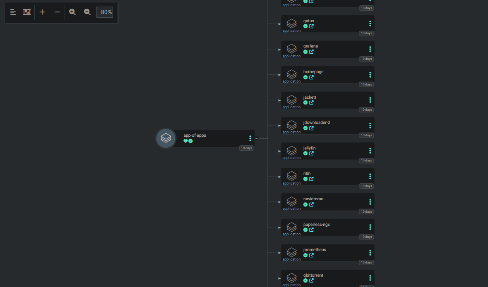
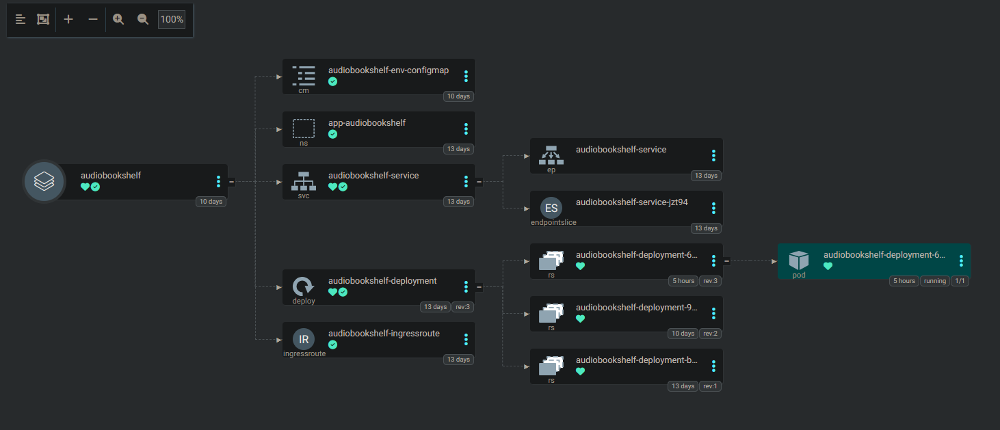

---
runme:
  id: 01HRNK3JJYGASTTB9MCAHH164T
  version: v3
---

# Project Name

## Overview

Welcome to the repository showcasing the Kubernetes infrastructure setup using Traefik, Authelia and ArgoCD. This project aims to streamline the bootstrapping process of your Kubernetes cluster. The infrastructure includes configurations for Traefik, Authelia, ArgoCD, and a convenient approach for managing applications using ArgoCD Apps.

## Getting Started

### Prerequisites

Ensure you have the following prerequisites installed:

- Kubernetes cluster configured with Traefik and ArgoCD (I use k3s installed via Ansible Playbook).

### Installation

1. Clone and/or fork this repository. Fork will be useful for implementing GitOps. If you pla on making your repo private, you must configure access to it for ArgoCD (such ass SSH keys), accordingly.
2. Modify the configurations in the `bootstrap` folder according to your setup. Do the same for argoCD manifests and Kubernetes manifests, modifying things like: your application repo, secrets, Ingress routes etc.
3. Apply the bootstrap configurations to your Kubernetes cluster:

```bash {"id":"01HRNK3JJX0VDT7E5DN4X2150G"}
kubectl apply -f bootstrap/
```

NOTE: For `bootstrap/04-app-of-apps.yml` in my case I had to manually copy it's content and apply from web UI as I had troubles with applying it via `kubectl apply`. Just FYI.

4. Once done, if ArgoCD is pointed to Github repo correctly and access is set, ArgoCD should soon start to deploy containers on your cluster following App of Apps pattern. Yay!

## Folder Structure

### bootstrap

The `bootstrap` folder contains initial configuration files to set up your cluster. Modify these files to match your environment.

- **01-tls-secret.yml**: DuckDNS API token for Traefik. I use DuckDNS as (free!) domain provider If you don't use you can skip it.
- **02-traefik-config.yaml**: Custom Traefik configuration for Let's Encrypt. Update with your domain and email for certificate. By default, staging certificate is used.

```yaml {"id":"01HRNK3JJX0VDT7E5DN69EG04J"}
  valuesContent: |-
    additionalArguments:
      - --entrypoints.websecure.http.tls.certresolver=le
      - --entrypoints.websecure.http.tls.domains[0].main=yourdomain.org # Here
      - --entrypoints.websecure.http.tls.domains[0].sans=*.yourdomain.org # Here
      - --certificatesresolvers.le.acme.dnschallenge.provider=duckdns
      - --certificatesresolvers.le.acme.email=mail@example.org # Mail
      - --certificatesresolvers.le.acme.dnschallenge.resolvers=1.1.1.1

    certResolvers:
      le:
        email: mail@example.org
        storage: "/data/acme.json"
        caServer: https://acme-staging-v02.api.letsencrypt.org/directory
        dnsChallenge:
          provider: duckdns
          delayBeforeCheck: 30
          resolvers:
            - "1.1.1.1:53"
            - "8.8.8.8:53"
```

etc.

- **03-argocd-ingressroute.yml**: IngressRoute for ArgoCD Web UI. You can also use `port-forwarding` if you don't wish use Traefik's routing but want to access web UI.
- **04-app-of-apps.yml**: ArgoCD Application manifest file for bootstrapping the App of Apps.

## ArgoCD App of Apps Pattern

The **App of Apps** pattern is a powerful approach to manage multiple applications using a single application definition. In the context of ArgoCD, the App of Apps refers to the central application that points to other applications. It acts as a meta-controller, allowing you to manage and synchronize multiple applications collectively.

The `04-app-of-apps.yml` file in this repository is the ArgoCD Application manifest implementing the App of Apps pattern. It points to the `argocd-apps/` folder, where individual application manifests are stored. This pattern simplifies the management of diverse applications, streamlining updates and deployments.



### argocd-apps

This folder includes ArgoCD Application manifests for performing GitOps on individual apps. Apps can be Helm charts (minority) or pointers to the `manifests/prod` folder I prepare for my needs.

You must adjust them so that they point to your repo.
Here's an example which bootstrap `audiobookshelf`, and will watch for any changes within `manifests/prod/audiobookshelf` on Github repository.

```yaml {"id":"01HRNK3JJYGASTTB9MC6TY8HF1"}
spec:
  project: default
  # https://argo-cd.readthedocs.io/en/stable/user-guide/multiple_sources/
  # Single source
  source:
      repoURL: git@github.com:knuurr/gitops-test.git
      path: manifests/prod/audiobookshelf
      targetRevision: main
```

End result will be fully deployed and functional `Audiobookshelf` container on your Kubernetes cluster, all within minutes.



If you ever feel to add changes, introduce them via changes via push to manifest files themself. Changes within repo will be reflected in your cluster within around 10 minutes max, depending on ArgoCD synchronisation settings.

### manifests

The `manifests` folder contains Kubernetes manifests.

- **prod**: Store your manifests for production deployments here.

Each manifest will need to have Secrets, enviromental variables adjusted. Most if not all are configured to be accessible via k8's `Ingress` therefore I advise you to adjust it all to your domain.

Example:

```yaml {"id":"01HRNK3JJYGASTTB9MC736JQ9A"}
  routes:
    - match: Host(`audiobookshelf.yourdomain.org`)
      kind: Rule
```

I advise you to check what applications I'm running and get rid of those you do not recognize to avoid issues with any misconfigured Deployments.

## Configuration Details

### DuckDNS Configuration

In the `01-tls-secret.yml` file, replace the DuckDNS API token with your own. DuckDNS is used for Traefik deployment.

### Traefik Configuration

Update the `02-traefik-config.yaml` file with your domain and email for Let's Encrypt.

### ArgoCD IngressRoute

Adjust the `03-argocd-ingressroute.yml` file for ArgoCD Web UI access via HTTP or alternative port forwarding.

### App of Apps

The `04-app-of-apps.yml` file is the ArgoCD Application manifest for the App of Apps. It manages the applications in the `argocd-apps/` folder within your monorepo.

## Assumptions

This repository assumes a Kubernetes cluster configured with Traefik and ArgoCD. The recommended installation method is using k3s via the provided Ansible Playbook.

## Additional info

Note that not apps might be running currently as I'm moving my Docker Compose stack. The main idea was to show the App of Apps pattern with ArgoCD. For private usage I use same philosophy but of course idffering applications, configurations and etc.

## Contributing

Feel free to contribute by opening issues, providing feedback, or submitting pull requests.

## Inspiration and further reading

- [A robust implementation of ArgoCD’s App Of Apps Pattern](https://medium.com/@ranrubin/a-robust-implementation-of-argocds-app-of-apps-pattern-97f8071e0de)
- [Cluster Bootstrapping](https://argo-cd.readthedocs.io/en/stable/operator-manual/cluster-bootstrapping/)
- [Bootstrapping Kubernetes with ArgoCD](https://alexsimonjones.medium.com/bootstrapping-kubernetes-with-argocd-989f27ae475)
